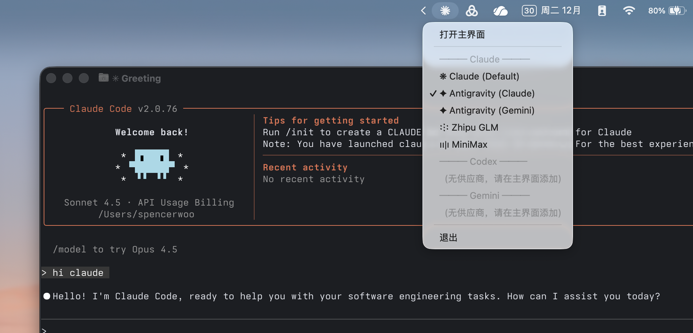
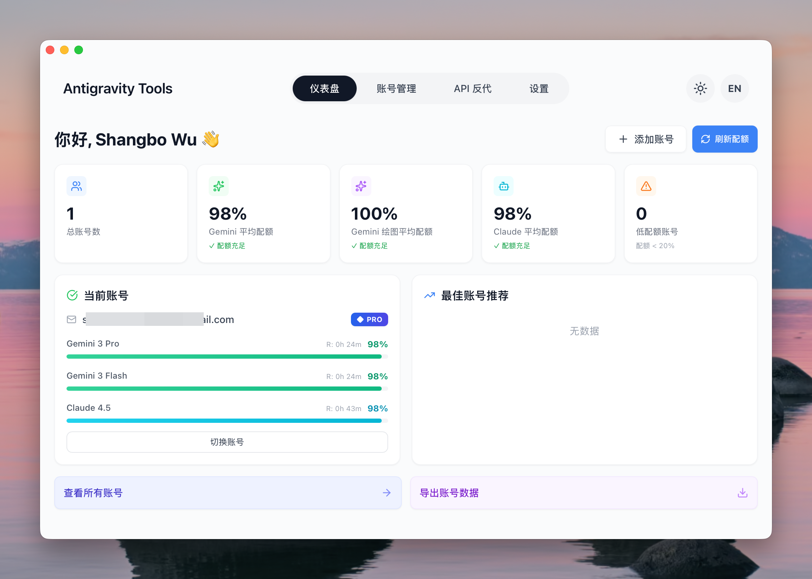
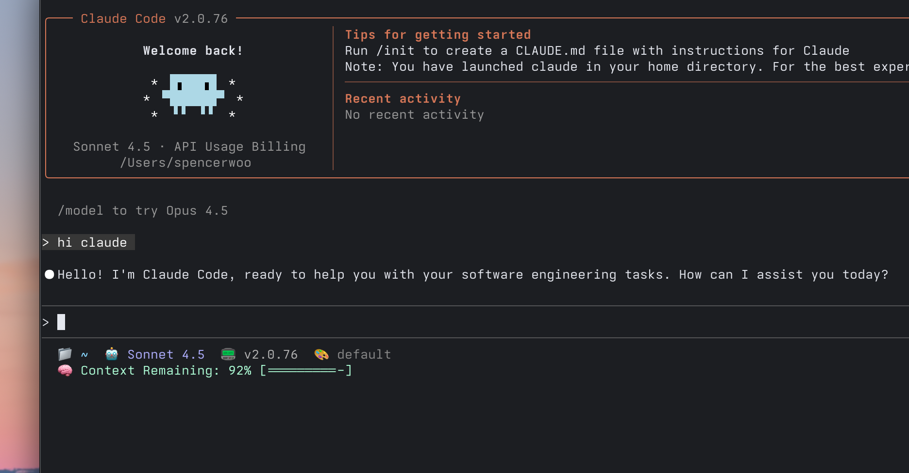

年终这篇就用贯穿 2025 年的 Agentic Coding 工具收尾了 —— Claude Code 🦀


Claude Code 是 Anthropic 官方推出的命令行 AI 编程助手。在上下文理解涌现出重要价值的今天，Claude Code 让 AI 自主的进行编程实现逐渐成为可能。

不过，Anthropic 对 🇨🇳 地区的访问限制已是人尽皆知。在国内的互联网环境下，使用起来确实需要一些功夫来配置。本文总结了我这几天的实践经验，将配置第三方 API、切换其他 LLM 模型、设置代理和状态栏等方面的策略 dump 如下，希望对读者有所帮助。

<!-- more -->

## Claude Code 的配置文件在哪儿

两个地方：

1. 自定义配置文件在 `~/.claude/settings.json`，一般情况，我们修改该文件；
2. Claude Code 运行时持久化配置在 `~/.claude.json`。

目前我只遇到一次需要修改后者的情况，即：当我们完成 Claude Code 注册初始化后，如果修改了 `~/.claude/settings.json`，需要让 Claude Code 知道我们已经完成 onboarding，不要再进入登录流程。

若存在此情况，需要在 `~/.claude.json` 中修改：

```diff
-  "hasCompletedOnboarding": false
+  "hasCompletedOnboarding": true
```

## Claude Code 的配置原理

Claude Code 原生登录方式只支持官方的 Claude 订阅（如 Claude Pro/Max），或通过命令 `/login` 认证 Claude 官网，并自动生成 API 密钥（其只在生成并被 Claude Code 本身请求时可见，后续登录管理后台都看不到）。

然而，在 🇨🇳 使用时，我们往往需要自定义密钥，或设置第三方的 API 地址。

截止到写作本文时，Claude Code 2.0 版本可以通过环境变量来设置 **API 地址** 和 **API 密钥**。

其中，前者是 `ANTHROPIC_BASE_URL`；后者则有两种情况：

1. 如果使用官方 API，则密钥的环境变量为 `ANTHROPIC_API_KEY`。此时 `ANTHROPIC_BASE_URL` 只能是 `https://api.anthropic.com`；
2. 如果使用第三方服务，则密钥需要使用 `ANTHROPIC_AUTH_TOKEN`。

环境变量可以持久化配置，保存在 `~/.claude/settings.json` 文件中，如：

```json
{
  "env": {
    "ANTHROPIC_AUTH_TOKEN": "your-api-key",
    "ANTHROPIC_BASE_URL": "https://your-claude-coding-api-url.com"
  }
}
```

因此，除官方服务外，无论使用哪种 API 服务，核心都是修改这两个环境变量。关键区别在于我们的 API 是否原生兼容 Claude API 格式，这决定了配置的复杂度。

## 当我们的 API 原生兼容 Claude 格式（情况一）

如果我们的 API 服务原生支持 Claude API 格式（如国内的智谱 GLM、MiniMax 和 Kimi 的 Coding 套餐），它们的接口格式与 Anthropic Claude API 完全一致，配置会非常简单。只需要修改环境变量，将 API 地址和密钥指向第三方服务：

```json
{
  "env": {
    "ANTHROPIC_AUTH_TOKEN": "your-api-key",
    "ANTHROPIC_BASE_URL": "https://third-party-api.com"
  }
}
```

如果需要在多个兼容服务之间频繁切换（比如在 Kimi、GLM、MiniMax 之间切换），手动编辑配置文件会比较麻烦。推荐使用 [cc-switch](https://github.com/farion1231/cc-switch) 这个 GUI 工具，其本质上是在帮我们管理 `settings.json` 中的环境变量，提供图形界面来保存多套配置（API 地址 + 密钥），点击即可切换。



因此，cc-switch 只适用于原生兼容 Claude API 格式的服务。它只负责切换环境变量，不涉及 API 格式转换。如果我们使用的所有 API 都兼容 Claude 格式，那么只用 cc-switch 就足够了。

## 当 API 不兼容 Claude 格式时（情况二）

如果我们想使用的 API 服务格式与 Claude API 不兼容（比如自定义的模型服务、OpenAI 格式的 API、其他厂商的 API 等），就需要进行格式转换。这种情况下配置稍微复杂一些，需要两步操作。

首先，使用像 claude-code-router 这样的中转服务在本地启动一个 proxy。这个 proxy 的作用是接收 Claude Code 发来的标准 Claude API 请求，将请求转换为目标 API 的格式，调用真实的 API 服务，然后将响应转换回 Claude API 格式并返回给 Claude Code。

接下来，同样需要修改环境变量，但这次 `ANTHROPIC_BASE_URL` 要指向本地的 router 地址（而不是直接指向第三方 API）：

```json
{
  "env": {
    "ANTHROPIC_AUTH_TOKEN": "your-api-key",
    "ANTHROPIC_BASE_URL": "http://localhost:port"
  }
}
```

在这一场景下，完整的请求链路如下：

- Claude Code 发出请求 →
- 本地 Router (`http://localhost:port`) 接收并转换格式 →
- 真实 API 服务处理 →
- Router 转换响应格式 →
- Claude Code 接收响应。

!!! tip "我们让 Claude Code 总结两种情况的本质区别："
    情况一（兼容 Claude 格式）：

    - 环境变量直接指向第三方 API 地址
    - 使用 cc-switch 快速切换多个兼容 API
    - 不需要额外的中转服务

    情况二（不兼容 Claude 格式）：

    - 启动本地 router 做格式转换
    - 环境变量指向本地 router 地址（`http://127.0.0.1:xxxx`）
    - router 负责将请求转发给真实 API 并做格式转换

    共同点：两种情况都需要修改环境变量，区别在于环境变量指向的目标不同（直接指向 API vs 指向本地 router）。因此，我们可以继续使用 cc-switch 管理环境变量配置，将本地 router 增加成为一个 Claude Code API 提供商。

## Bonus：用 Antigravity 获取充足的 Claude 配额

如果是 Gemini 付费会员（[Google AI Pro/Ultra](https://gemini.google/subscriptions/)），[Antigravity](https://antigravity.google/) 提供了非常充足的 Claude 模型用量。

推荐使用 [Antigravity Tools](https://github.com/lbjlaq/Antigravity-Manager) 这个 GUI 桌面应用来管理 Antigravity 配置。它是跨平台桌面应用（支持 macOS、Windows、Linux），提供了多账户管理、实时配额监控、智能账户推荐等功能，并能将 Web Session 转换为标准 API 接口。



Antigravity Tools 也可以算作一个 router，符合上面介绍的「情况 2」。配置完成后，将 `ANTHROPIC_BASE_URL` 指向 Antigravity 的 API 地址即可。

## 优化 settings.json 配置

除了基本的 API 配置外，`settings.json` 还支持一些实用的配置项。

首先，我们可以通过设置环境变量来禁用非必要的网络请求和模型调用，从而提升响应速度、降低 API 使用量：

```json
{
  "env": {
    "CLAUDE_CODE_DISABLE_NONESSENTIAL_TRAFFIC": true,
    "DISABLE_NON_ESSENTIAL_MODEL_CALLS": true
  }
}
```

默认情况下，Claude Code 会在 git commit 消息中添加 `Co-authored-by: Claude` 标记。如果不希望添加此标记，可以通过设置 `includeCoAuthoredBy` 为 `false` 来关闭：

```json
{
  "includeCoAuthoredBy": false
}
```

另一个实用的配置是权限策略。通过 `permissions` 配置，我们可以预先批准某些操作（`allow`），避免每次都需要确认；也可以禁止某些操作（`deny`），防止意外执行危险命令。例如：

```json
{
  "permissions": {
    "allow": [
      "WebSearch",
      "WebFetch(domain:*)",
      "Read",
      "Grep",
      "Glob",
      "Bash(cd:*)",
      "Bash(ls:*)",
      "Bash(npm:*)",
      "Bash(git status:*)",
      "Bash(git diff:*)",
      "Bash(git log:*)"
    ],
    "deny": ["Bash(git commit:*)", "Bash(git push:*)", "Bash(rm -rf:*)"]
  }
}
```

这个配置允许 Claude Code 自动进行网络搜索、文件读取和安全的 git 查询操作，但禁止它直接执行 git commit、push 等可能修改仓库的命令，以及删除操作，这些都应需要手动确认。

## 配置 Claude Code 状态栏

Claude Code 支持在 TUI 界面底部显示自定义状态栏，展示当前的 git 分支、时间、token 使用情况等信息。推荐使用 [cc-statusline](https://github.com/chongdashu/cc-statusline) 提供的状态栏脚本。

配置过程很简单。运行以下命令安装：

```bash
npx @chongdashu/cc-statusline@latest init
# 或使用 bunx
bunx @chongdashu/cc-statusline@latest init
```

这个命令会自动在 `settings.json` 中添加状态栏配置：

```json
{
  "statusLine": {
    "command": "~/.claude/statusline.sh",
    "padding": 0,
    "type": "command"
  }
}
```

配置完成后，Claude Code 会在底部显示实时的状态信息，让我们更好地掌握当前的工作环境。



## 小结

通过合理配置 Claude Code，我们可以：

1. 灵活切换不同的 API 服务（cc-switch）
2. 接入自定义 API 提供商（claude-code-router）
3. 使用 Antigravity 获取充足的 Claude 配额
4. 优化 settings.json 配置以提升使用体验
5. 配置状态栏以获得更好的 TUI 体验

这些技巧可以让 Claude Code 更加强大和灵活，适应不同的使用场景和需求。

此外，OpenAI CodeX、谷歌的 Gemini CLI 等大厂推出的工具，AMP、OpenCode 等其他厂商的产品，以及国内的 Kimi for Coding、GLM 等工具，想必也都有类似的优化技巧。

We leave them as honorable mentions.

---

参考资源：

- [cc-switch](https://github.com/farion1231/cc-switch) - Claude Code API 配置快速切换工具
- [claude-code-router](https://github.com/musistudio/claude-code-router) - API 格式转换 proxy 工具
- [Antigravity Tools](https://github.com/lbjlaq/Antigravity-Manager) - Antigravity GUI 桌面管理应用
- [cc-statusline](https://github.com/chongdashu/cc-statusline) - Claude Code 状态栏脚本

> **致谢**：本文的撰写离不开 Claude Code 对我杂乱思绪的规范整理，离不开 Gemini、GLM 对学术化用语的文风润色，也离不开 Nano Banana Pro 对题图绘制的大力支持。
