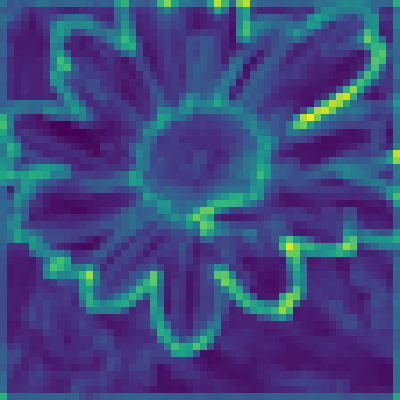

To quote myself in a most recently yet-to-be-published paper:

> 💪 The ability of deep neural networks (DNNs) come from extracting and interpreting features from the data provided.

What we call, *deep features*, are the abstract, latent representations that are naturally derived from the training data fed into the DNN. They reflect a consistent activation or response of a layer/node within the model hierarchy to an input.

<figure markdown>
  
  <figcaption>The features from within a pretrained VGG-11 (top) and ResNet-18 (bottom) on layers of different depths visualized.</figcaption>
</figure>

<!-- more -->

Generic and semantic deep representations that DNNs learn through training on even simple image-level labels (supervised learning for classification), **allow them to build both global understandings and localizable features of images** that empower downstream tasks including object detection, similarity measurement, among others. Most often, these features are what we are after.

Using *__hooks__*, we will be able to extract these internal data from within DNNs, **with the benefit of NOT having to tamper with model source code or even deconstructing the model itself.** They are one of the best ways for us to probe into model internals without having to tear the model apart.

!!! info "The `torch-featurelayer` library"
    I have recently made [`torch-featurelayer`](https://github.com/spencerwooo/torch-featurelayer) - *🧠 Useful utility functions and wrappers for hooking onto layers within PyTorch models for feature extraction* - available to `pip` download and install. If you are in a hurry, go take a look at how this library is implemented.

## What a DNN looks like internally

PyTorch models are constructed through layer-stacking.

Take the infamous VGG-11 model for example:

```python
from torchvision.models import vgg11

model = vgg11()
```

```pycon
>>> model
VGG(
  (features): Sequential(
    (0): Conv2d(3, 64, kernel_size=(3, 3), stride=(1, 1), padding=(1, 1))
    (1): ReLU(inplace=True)
    (2): MaxPool2d(kernel_size=2, stride=2, padding=0, dilation=1, ceil_mode=False)
    ...
    (18): Conv2d(512, 512, kernel_size=(3, 3), stride=(1, 1), padding=(1, 1))
    (19): ReLU(inplace=True)
    (20): MaxPool2d(kernel_size=2, stride=2, padding=0, dilation=1, ceil_mode=False)
  )
  (avgpool): AdaptiveAvgPool2d(output_size=(7, 7))
  (classifier): Sequential(
    (0): Linear(in_features=25088, out_features=4096, bias=True)
    ...
    (4): ReLU(inplace=True)
    (5): Dropout(p=0.5, inplace=False)
    (6): Linear(in_features=4096, out_features=1000, bias=True)
  )
)
```

On the outmost layer, the model is composed of three modules: `features`, `avgpool`, and `classifier`. Inside of which, are layers, including `Conv2d`, `ReLU`, and `MaxPool2d`, etc., stacked sequentially.

When an image of shape $[B, C, W, H]$ (i.e., batch, channel, width, and height: $[1, 3, 224, 224]$) is fed into the VGG-11 model:

- Layer `features` is the convolutional backbone, extracting features from the image.
- After feature extraction, layer `avgpool` averages the features spatially.
- Finally, layer `classifier` classifies the image into one of the 1000 classes.

## How to *hook* onto features?

The features extracted by the `features` module in VGG-11 is often what we are most interested in.

!!! tip "Do all DNNs have a `features` module?"
    **Definitely no.** For VGG models, we have `features`. Whereas for ResNet models, we have `layers1`, `layers2`, ..., and for ViTs, we have `blocks.1`, `blocks.2`, ..., and so on. Different models have different internal names for their layers.

Different models are constructed with different modules and components as layers, where each layer is responsible for extracting some part of the feature dimensions. In PyTorch, the model hierarchy is a Python object, where to reference, say, the 5th layer inside the `features` module, you would:

```pycon
>>> model.features[5]
MaxPool2d(kernel_size=2, stride=2, padding=0, dilation=1, ceil_mode=False)
```

This is where **hooks** are going to come into the picture.

To get the output of said layer when an image is fed, or forwarded, into the model, we would be using the **PyTorch hook**. More specifically, the `register_forward_hook()`, to enable the hook trigger *after* the data flows through this specific layer.

We first define our *hook*, which is essentially a callback function.

```python
# a globally accessible placeholder for capturing the output of the layer
feat_out = None


def hook(module, inp, out):
    global feat_out  # not the best way to reference `feat_out` though
    feat_out = out
```

The hook is registered by applying `register_forward_hook()` on the specific layer, **meaning that the hook function is called (triggered) when data passes through the layer it is hooked on.**

```python
h = model.features[5].register_forward_hook(hook)
```

!!! info "The available PyTorch hooks"
    - `register_forward_hook` - To register a hook to be called after the `forward()` call has computed an output.
    - `register_forward_pre_hook` - To register a hook to be called before the `forward()` call.
    - `register_full_backward_hook` - To register a backward hook to be called when the **gradients** with respect to a module are computed.
    - `register_full_backward_pre_hook` - To register a backward hook to be called before ... you get the idea.

    Take a look at the docs for [`torch.nn.modules.module`](https://pytorch.org/docs/stable/_modules/torch/nn/modules/module.html) for details. 

A handle `h` is returned so we can remove the hook for releasing resource later on.

We take care of the input image.

```python
from PIL import Image
import torchvision.transforms as transforms

# specify image transform and normalize
transform = transforms.Compose(
    [
        transforms.Resize(256),
        transforms.CenterCrop(224),
        transforms.ToTensor(),
        transforms.Normalize(mean=[0.485, 0.456, 0.406], std=[0.229, 0.224, 0.225]),
    ]
)
# load image from local path
image = Image.open("/path/to/image.png")
# apply transform and normalize and add the batch dimension
image = transform(image).unsqueeze(0)
```

Finally, by feeding the designated image into the VGG-11 model, we can capture the internal output of the specific layer.

```pycon
>>> # before forwarding the image, `feat_out` is None
>>> feat_out
None
>>> output = model(image)
>>> # after feeding the image into the model, `feat_out` is applied the value 
>>> # of the output at the hooked layer, as the hook is triggered when called
>>> feat_out
tensor([[[[0.5222, 0.1216, 0.1468,  ..., 0.4285, 0.4091, 0.0342],
          [0.4367, 0.2613, 0.0832,  ..., 0.3369, 0.4722, 0.0000],
          [0.3566, 0.4006, 0.1355,  ..., 0.0868, 0.0000, 0.1008],
          ...,
          [0.3611, 0.0551, 0.1519,  ..., 0.0000, 0.0000, 0.1258],
          [0.0957, 0.1216, 0.0000,  ..., 0.0000, 0.0550, 0.0000],
          [0.3259, 0.0000, 0.3696,  ..., 0.0727, 0.0809, 0.0474]]]],
       grad_fn=<MaxPool2DWithIndicesBackward0>)
>>> feat_out.shape
torch.Size([1, 128, 56, 56])
```

At the very end, do not forget to release the hook.

```python
h.remove()
```

## What about `torch-featurelayer`?

Thank you for still remembering!

If you are already using `torch-featurelayer`, you would be relieved of the hassle of initializing placeholder variables, releasing resources manually, and so on.

To list all available layers to hook onto.

```pycon
>>> import torch_featurelayer as tl
>>> layers = tl.get_layer_candidates(model, max_depth=2)  # we can specify a max_depth
>>> [l for l in layers]
['features', 'features.0', 'features.1', 'features.2', 'features.3', 'features.4', 'features.5', 'features.6', 'features.7', 'features.8', 'features.9', 'features.10', 'features.11', 'features.12', 'features.13', 'features.14', 'features.15', 'features.16', 'features.17', 'features.18', 'features.19', 'features.20', 'avgpool', 'classifier', 'classifier.0', 'classifier.1', 'classifier.2', 'classifier.3', 'classifier.4', 'classifier.5', 'classifier.6']
```

To extract the same layer output from the 5th layer of the `features` module in VGG-11.

```python
import torch_featurelayer as tl

f_layer_path = "features.5"  # notice how we represent the 5th layer
hooked_model = tl.FeatureLayer(model, f_layer_path)

feat_out, output = hooked_model(image)  # the layer output and the model output are both returned
```

To extract multiple layers' outputs on one pass.

```python
import torch_featurelayer as tl

f_layer_paths = [
  "features.0",
  "features.6",
  "features.12",
  "features.18",
]
hooked_model = tl.FeatureLayers(model, f_layer_path)

feat_outs, output = hooked_model(image)  # the layer outputs are returned in a list
```

## Taking a look at the layer's output

What is so special about the model's internal layer output?

The output, `feat_out`, as we have hooked and extracted from the VGG-11 model, is a tensor of shape $[1, 128, 56, 56]$. **The data it holds represent the deep features that VGG-11 was able to learn during supervised training.**

The image that we were using all along is this.

<figure markdown>
  { width=250 }
  <figcaption>An image from the ImageNet dataset.</figcaption>
</figure>

To visualize `feat_out`, the $[1, 128, 56, 56]$ shaped tensor, specifically, the channel dimension $128$, should first be flattened into an *image-like* shape. **We apply `mean()` over the channel dimension, and omit the batch dimension.**

```python
fmap = feat_out.mean(dim=1).squeeze()  # flatten to image-like shape
fmap = fmap.cpu().detach().numpy()  # move to cpu
```

We then apply min-max normalization.

```python
fmap = (fmap - fmap.min()) / (fmap.max() - fmap.min())
```

Finally, we plot the `fmap` feature map with `matplotlib`.

```python
import matplotlib.pyplot as plt

plt.figure(figsize=(4, 4))
plt.imshow(fmap, cmap="viridis")
plt.axis("off")
plt.tight_layout(pad=0)

plt.show()
```

<figure markdown>
  { width=250 }
  <figcaption>Visualization of the internal layer output of VGG-11.</figcaption>
</figure>

We are now able to visualize what features exactly was learnt by VGG-11 at the `features` module on layer 5. This is often what we call the *feature maps* of ConvNets.

## Moving forward

The VGG architecture that we have been using in this example, is especially good at extracting high fidelity, semantically meaningful deep features from images, which is one of the most widely used model architectures at representing images at the latent dimensions. It has been successfully used for image similarity assessment, super resolution, and style transfer (think GANs).

As the basis of vision tasks, different models with supervised training for image classification tasks learn various features, hidden within their internal layers. These features, again, are the essential building blocks leveraged for more complex, in-depth downstream tasks.  

By leveraging *hooks* in PyTorch, we are able to extract features at various levels of internal layers, without having to take the entire model apart. We would still be able to use existing pretrained model weights, while enjoying the benefits of a cleaner codebase. 
