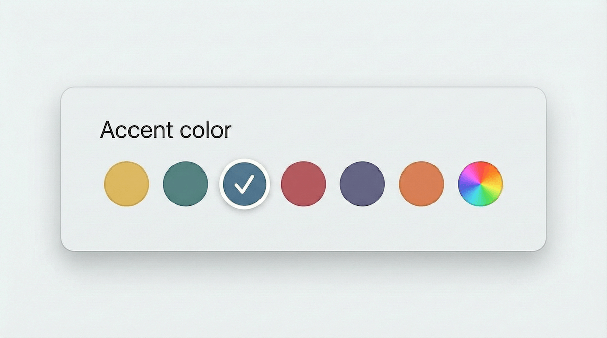
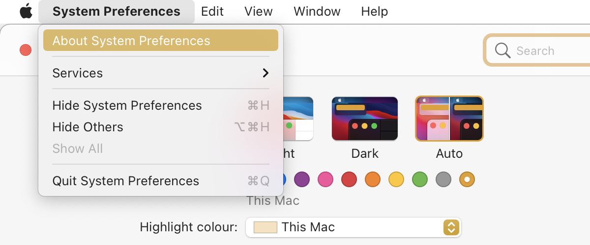
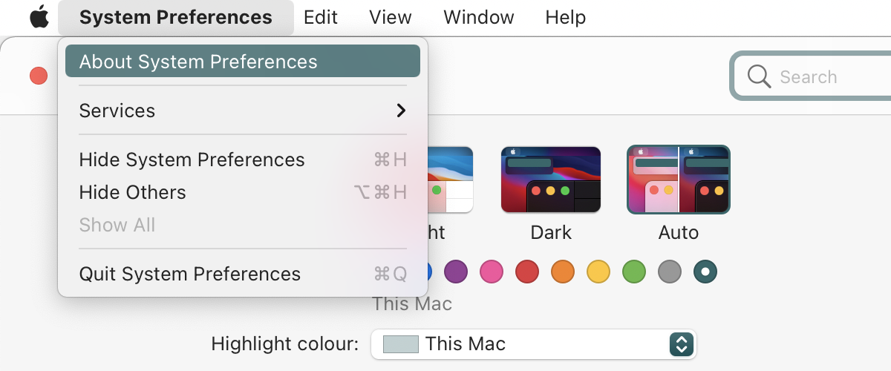
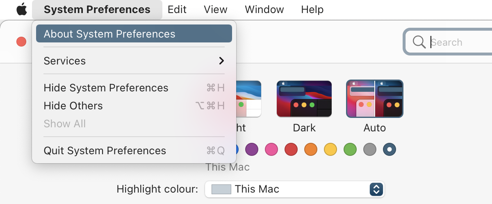
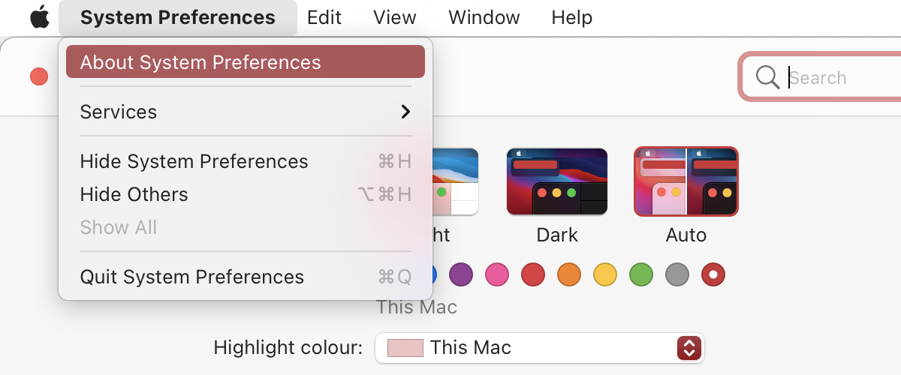
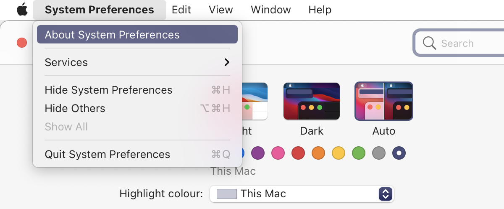
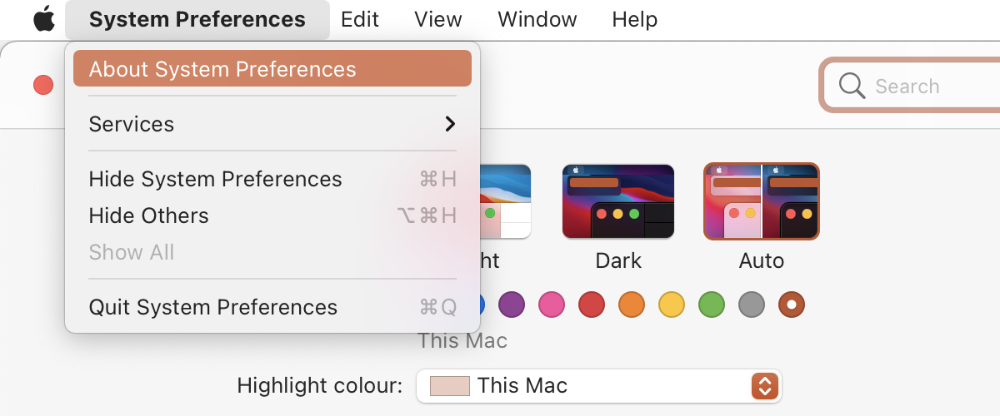

iMac M1 引入了多种机身配色，macOS 11.3.1+ 在系统中预留了对应的强调色选项，**但默认隐藏。**
通过修改 macOS `defaults` 配置，可在任意 Mac 上启用这些强调色。

每次都需要去查一下具体配色的配置方法，今天这里简单记录一下。:smile:

<!-- more -->

## 启用硬件强调色

```bash
defaults write -g NSColorSimulateHardwareAccent -bool YES
```

## 设置颜色

```bash
defaults write -g NSColorSimulatedHardwareEnclosureNumber -int <颜色代码>
```

| 代码 | 颜色 | 预览 |
| :--: | :--: | :-- |
|  3   | 黄色 |  |
|  4   | 绿色 |  |
|  5   | 蓝色 |  |
|  6   | 粉色 |  |
|  7   | 紫色 |  |
|  8   | 橙色 |  |

## 生效

重启应用程序或注销并重新登录。

## 恢复默认

```bash
defaults delete -g NSColorSimulateHardwareAccent
defaults delete -g NSColorSimulatedHardwareEnclosureNumber
```

## 参考

[How to use iMac M1 accent colours on any Mac | George Garside](https://georgegarside.com/blog/macos/imac-m1-accent-colours-any-mac/)
