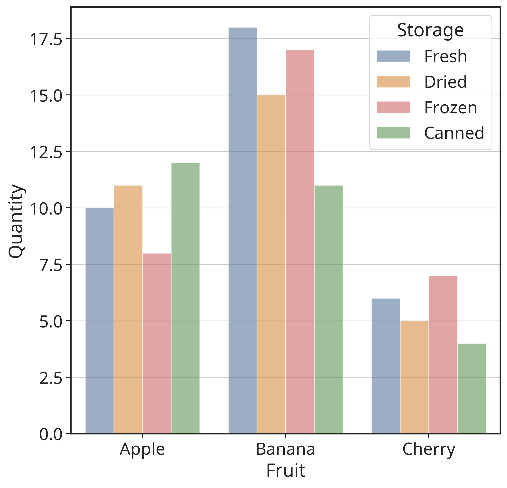
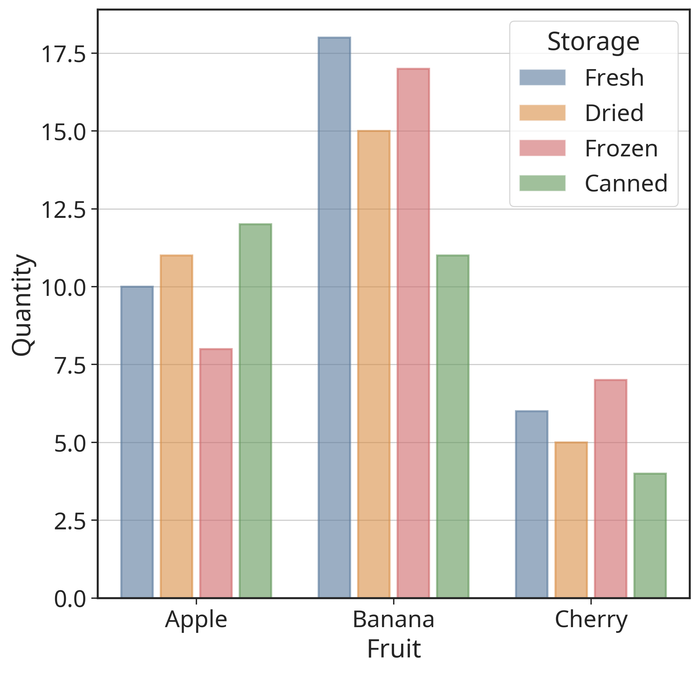
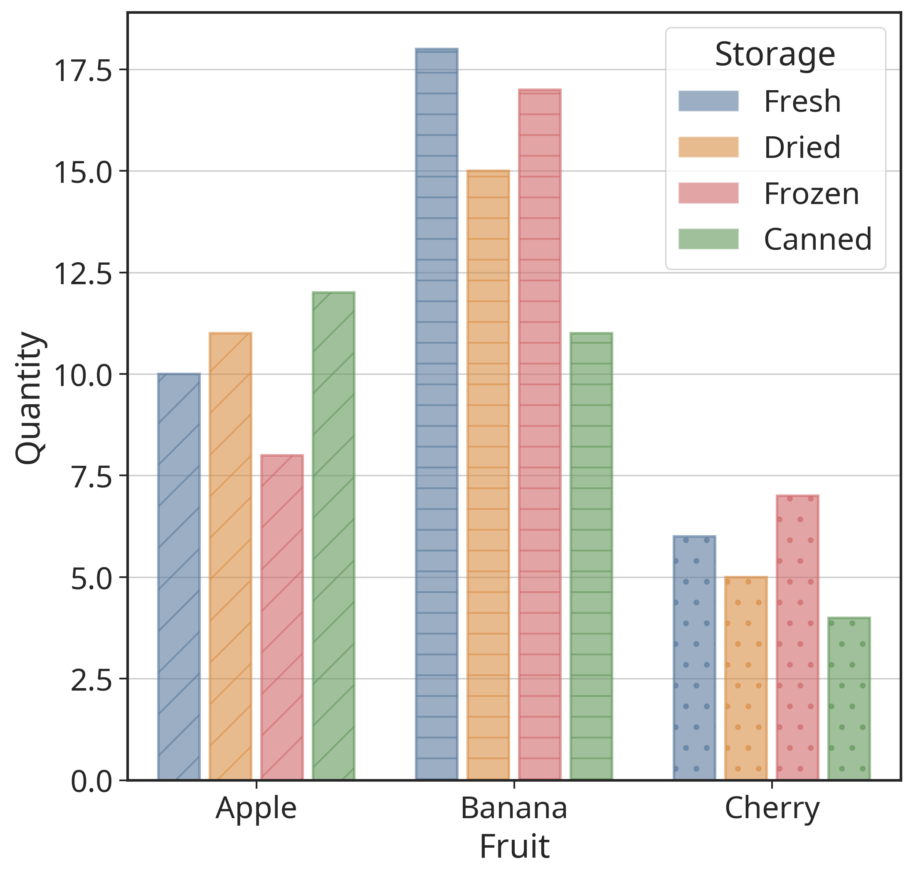

`matplotlib` -- the de-facto library of plotting in Python.

`seaborn` -- the golden tool for statistical data visualization. Also comes with **nice style defaults**.

I have found myself using both libraries frequently with some style preferences that I usually adopt when creating plots. For the sake of reproducibility and convenience, I have collected some of these snippets here.

<!-- more -->

## Global style definitions

```python
import matplotlib.pyplot as plt
import seaborn as sns

sns.set_theme(context='paper', style='ticks', font_scale=2)
plt.rcParams['font.family'] = 'Noto Sans'
plt.rcParams['axes.grid'] = True
plt.rcParams['axes.linewidth'] = 1.5
```

These give the plotted figure a clean outline with essential ticks on the axes.

## Nicer bar plots

The default scheme in `seaborn` (on the left) is already quite nice, but with the following tweaks, we can make it even prettier.

<figure markdown="span">
    { width="900px" }
    <figcaption>Left: default seaborn scheme. Right: our tweaks.</figcaption>
</figure>

We will be using this color palette.

```python
palette = ["#4E79A7", "#F28E2B", "#E15759", "#59A14F", "#76B7B2", "#EDC949"]
```


```python
import pandas as pd

# Mock some data here in a pandas DataFrame
data = pd.DataFrame(
    {
        "Fruit": ["Apple", "Banana", "Cherry"] * 4,
        "Quantity": [10, 15, 7, 12, 18, 5, 8, 11, 6, 11, 17, 4],
        "Storage": ["Fresh", "Dried", "Frozen", "Canned"] * 3,
    }
)
```

We plot the bar plot with `seaborn` on the axes we create with `matplotlib`. We apply **a subtle transparency** to the colors of the bars.

```python hl_lines="9"
fig, ax = plt.subplots(figsize=(8, 8))

sns.barplot(
    data=data,
    x="Fruit",
    y="Quantity",
    hue="Storage",
    palette=palette,
    alpha=0.6,  # i've always found some transparency in bar plots to be helpful
    ax=ax,
)
```

<figure markdown="span">
    { width="450px" }
    <figcaption>Plot with transparency added.</figcaption>
</figure>

Now, we are going to iterate over the bar patches within the plot, and:

- Set the edge color to a solid color with a thicker stroke.
- Add some breathing space between the bars.

```python
gap = 0.2  # adjust this value to change the gap between bars

for _, bar in enumerate(ax.patches):  # may need to change this axis
    # Set edge color and linewidth
    clr = bar.get_facecolor()
    bar.set_edgecolor((*clr[:3], 1))  # opaque borders
    bar.set_linewidth(1.5)

    # Adjust the width and position of the bars
    width = bar.get_width()
    bar.set_width(width * (1 - gap))
    bar.set_x(bar.get_x() + (width - width * (1 - gap)) / 2)
```

<figure markdown="span">
    { width="450px" }
    <figcaption>Plot with edges and gaps added.</figcaption>
</figure>

Finally, we will also add hatches to the bars for better visual distinction.

```python
# Customize this list as preferred, options include:
# ['/', '-', '.', '/', '-', '.', '/', '-', '.', '/', '-', '.']
hatches = ['/', '-', '.']

for i, bar in enumerate(ax.patches):
    bar.set_hatch(hatches[i % len(hatches)])
```

<figure markdown="span">
    { width="450px" }
    <figcaption>Plot with hatches added.</figcaption>
</figure>

> For more hatch pattern options and examples, see [Matplotlib Hatch Style Reference](https://matplotlib.org/stable/gallery/shapes_and_collections/hatch_style_reference.html).

## Saving figures

My only tip for saving figures is to apply `.tight_layout()` to the plot, and use `bbox_inches='tight'` to ensure that the saved figure does not have unnecessary whitespace around it.

```python
fig.tight_layout()  # or plt.tight_layout()
plt.savefig('figure.png', dpi=300, bbox_inches='tight')
```

> May be continued ...
