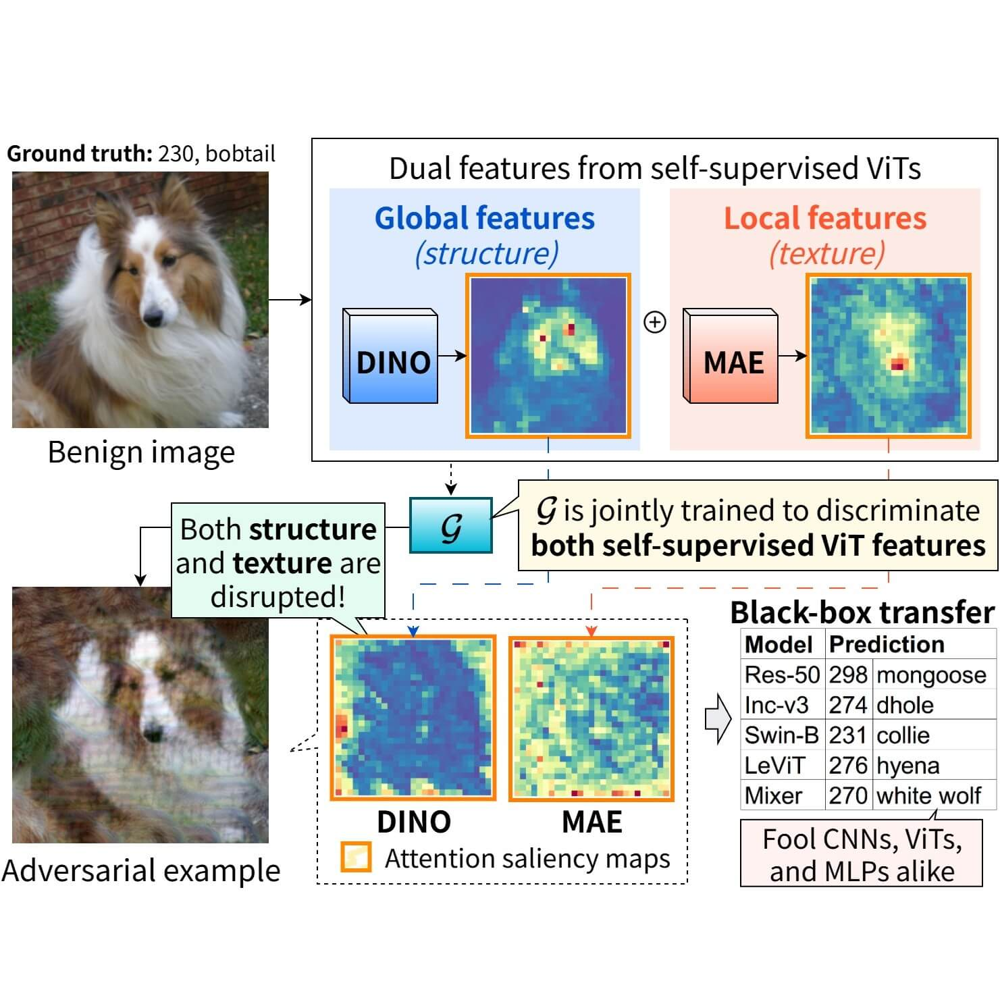
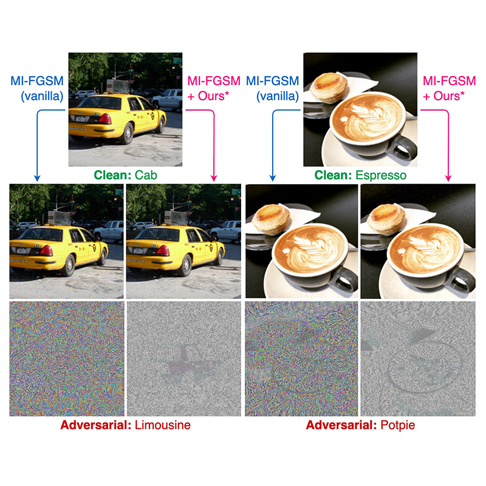
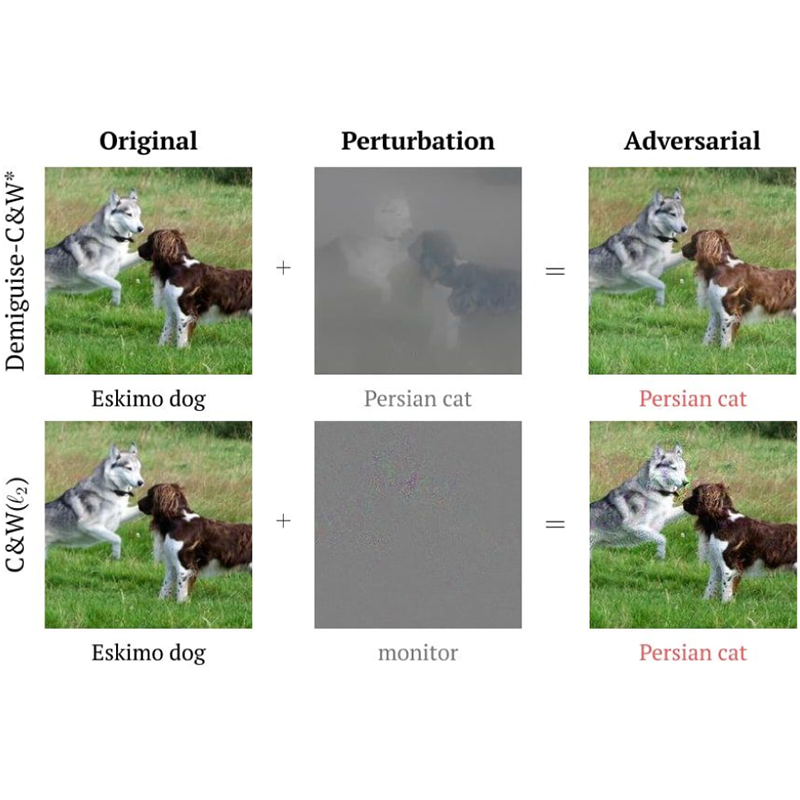

---
hide:
  - footer
  - toc
  - navigation
---

> A selected list of my publications. [:simple-googlescholar: Google Scholar](https://scholar.google.com/citations?user=Mf-JoyQAAAAJ) | [:simple-orcid: ORCID](https://orcid.org/0000-0002-0737-7420)

---

{ .pub-img }

#### [Boosting Generative Adversarial Transferability with Self-supervised Vision Transformer Features](https://arxiv.org/abs/2506.21046)

**^^Shangbo Wu^^**, Yu-an Tan, Ruinan Ma, Wencong Ma, Dehua Zhu, Yuanzhang Li^†^

> _(To appear in the) International Conference on Computer Vision, ICCV, 2025_

<!--  -->

{ .pub-img }

#### [Towards transferable adversarial attacks with centralized perturbation](https://doi.org/10.1609/aaai.v38i6.28427)

**^^Shangbo Wu^^**, Yu-an Tan, Yajie Wang, Ruinan Ma, Wencong Ma, Yuanzhang Li^†^

> _Proceedings of the AAAI Conference on Artificial Intelligence, AAAI, March 2024_

{ .pub-img }

#### [Demiguise attack: Crafting invisible semantic adversarial perturbations with perceptual similarity](https://doi.org/10.24963/ijcai.2021/430)

Yajie Wang\*, **^^Shangbo Wu^^\***, Wenyi Jiang, Shengang Hao, Yu-an Tan, Quanxin Zhang^†^

> _International Joint Conference on Artificial Intelligence, IJCAI, July 2021_

N.B.: ^\*^ equal contribution, ^†^ corresponding author.
