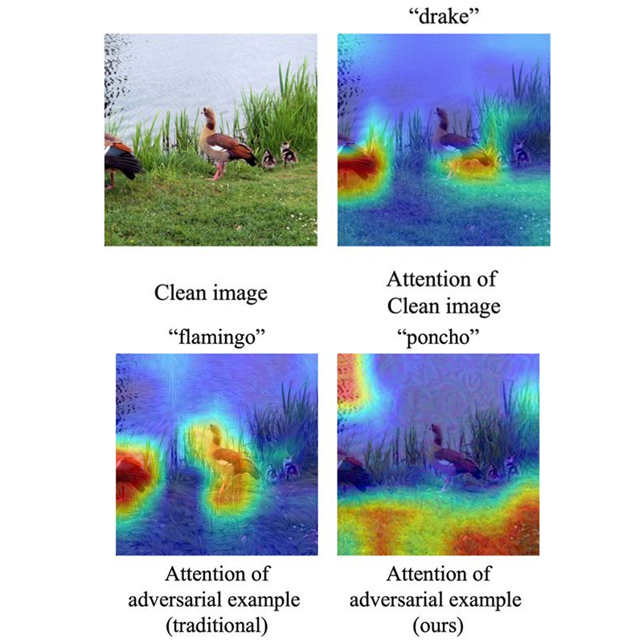

---
hide:
  - footer
  - toc
  - navigation
---

A selected list of my publications. [:simple-googlescholar: google scholar](https://scholar.google.com/citations?user=Mf-JoyQAAAAJ) | [:simple-orcid: orcid](https://orcid.org/0000-0002-0737-7420)

---

{ .pub-img align=right }

#### [Towards transferable adversarial attacks with centralized perturbation](https://doi.org/10.1609/aaai.v38i6.28427) :star2:

> **Shangbo Wu***, Yu-an Tan, Yajie Wang, Ruinan Ma, Wencong Ma, Yuanzhang Li^

<em>A transferable adversarial attack via dynamic, fine-grained centralization of perturbation on dominating frequency coefficients.</em>

:material-book-variant: Proceedings of the AAAI Conference on Artificial Intelligence, March 2024

{ .pub-img align=right }

#### [Toward feature space adversarial attack in the frequency domain](https://doi.org/10.1002/int.23031)

> Yajie Wang\*, Yu-an Tan, Haoran Lyu, **Shangbo Wu***, Yuhang Zhao, Yuanzhang Li^

<em>Attacking in the feature space via spectral transformation.</em>

:material-book-variant: International Journal of Intelligent Systems, Aug 2022

{ .pub-img align=right }

#### [Demiguise attack: Crafting invisible semantic adversarial perturbations with perceptual similarity](https://doi.org/10.24963/ijcai.2021/430) :star2:

> Yajie Wang\*, **Shangbo Wu***, Wenyi Jiang, Shengang Hao, Yu-an Tan, Quanxin Zhang^

<em>Leveraging perceptual similarity to craft adversarial perturbation that is invisible to humans.</em>

:material-book-variant: International Joint Conference on Artificial Intelligence, July 2021
